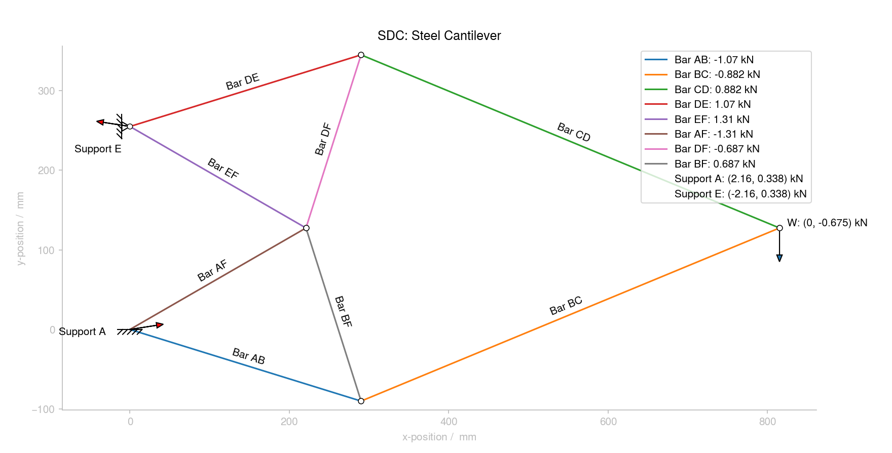

# Simple Truss Calculator

Calculator with display for finding internal/reaction forces, stresses and strains of a pin-jointed, straight-membered, plane truss.

100% Python; intended for personal use only but documented as a module.
Soon I hope to make it more user-friendly and interactive.
See `Source/Truss_Calculator.py` for the program.

Assumes linear elasticity and small deflections: I will *not* be implementing plastic behaviour or FEA to keep it *simple*.

## To-do List and Future Aims

### Create a basic program

  Goal: to make a simple once-per-use calculator.

  * [x] Create the core program using an object-oriented approach
  * [x] Add factory functions to build the objects
  * [x] Make it show the result on a static diagram with `matplotlib`
  * [x] Add unit testing with `PyTest`

### Make a Flask app for a GUI

  Goal: to make an interactive app

### Implement truss optimisation

## Notes

Code is linted with `flake8`. Testing is done (currently) with the built-in `unittest`.

## Why I made this

The idea for creating this program came from the Structural Design Course (SDC) long lab project in Part IA (1st year) of the Engineering course at the University of Cambridge. I originally wrote about 30 lines of code just to check some calculations of my own, then thought about making it work for any truss so I could improve it. After the lab ended I continued working on it in my spare time just for fun. Maybe someone else can get some use out of it too..?

## Donations

If you found this especially useful, you could consider giving me a cuppa :coffee: :smile:

&emsp;&emsp;

